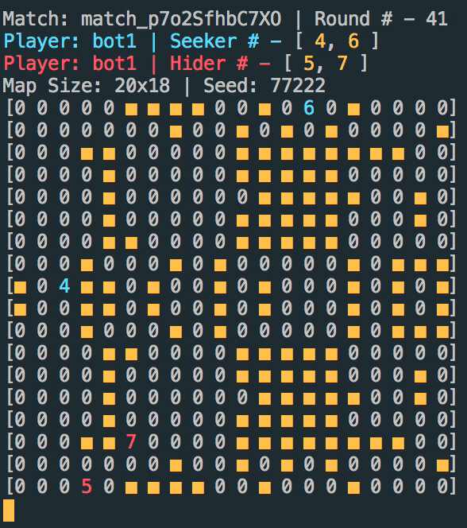

# Hide and Seek AI Competition 🙈 🏃

Welcome to the Hide and Seek AI competition! This is ACM AI's first competition prototype so expect *many* bugs but also lots of fun! You can compete and submit as many bots as you like during the competition from May 26th to July 6th, 11:59PM. Now what is the game?



It's like hide and seek and also tag. Your AI will need to be able to play as both the seeker and the hider. Your AI's objective as the seeker is to find the hiders and tag them. Your AI's objective as the hider is to dodge the seekers and hide from them until the game ends.

Read the [specs](#specs) for specific information on how the competition works. You can compete by yourself or work with others and submit one bot. Moreover, we are enforcing a set of [rules](#rules) we ask every competitor to abide by.

Keep reading to see how to get started really quick and compete with your bots on https://ai.acmucsd.com/. Remember that you don't need any machine learning to win (but you can do that if you want)

Once you have a bot, make sure to go to https://ai.acmucsd.com/ to register an account and upload your bot there! You can upload as many times as you want to see how it performs against other bots! Make sure to follow the upload instructions, and see [this](#submission) for help on how to zip your files correctly and upload them. We will compute final rankings after the deadline June 23rd, 11:59 PM, by running a lot of matches.

If you have issues with writing a bot, uploading a bot, bugs in the engine, feel free to submit an issue to this repository or ping us in the #competitions channel on discord we will get to them ASAP. There is also a [FAQ](#faq) section here for some common bugs.

NOTE, Windows is not supported, you have to use WSL, for installation instructions for WSL [go here](https://github.com/KNOXDEV/wsl) (thank you Aaron)

## Getting Started

First ensure you are running Node v12 or above and have npm installed. Check this by running `node -v` and `npm -v`. If you don't have them, see [this section](#setup) for setting up your environment to start running hide and seek games.

First install all files necessary, run the following

```bash
npm install dimensions-ai
sudo npm install -g @acmucsd/hide-and-seek-ai
```

Now, you have access to the `hide-and-seek` command, which can be used to watch matches and run matches.

Download a starter kit of your choice from this repository in the `kits` folder or click the following to download kits for different languages. [C++](https://storage.cloud.google.com/hide_and_seek_olbptg/kits/cppstarter.zip), [Javascript](https://storage.cloud.google.com/hide_and_seek_olbptg/kits/jsstarter.zip), [Java](
https://storage.cloud.google.com/hide_and_seek_olbptg/kits/javastarter.zip), [Python](https://storage.cloud.google.com/hide_and_seek_olbptg/kits/pystarter.zip)

We will be using the JS kit as an example. Suppose in the same folder there is a kits folder with js bots in the directory `./kits/js/bot.js`. The `bot.js` file is a main file, which every bot needs in the root directory of the bot. To run a match, run the following

```
hide-and-seek ./kits/js/bot.js ./kits/js/bot.js --live=true
```

This will run the match live in your terminal. Set `--live=false` to make the match skip the live view and run as fast as possible. Furthermore, ensure you have the correct tooling to run your bots. E.g. if you have a java bot, make sure `javac` works. See [this](#how-do-we-run-your-bots) for info on what tooling is required for each bot language and how to match the servers.

Matches will create a replay file of the format of `match_<some long id>.json` in the replays folder. To watch the replay, run

```
hide-and-seek -w ./replays/match_<some long id>.json --delay=0.2
```

Set `--delay` to equal any number of seconds, representing the delay between each frame of the match. `0.2` for example represents 1/0.2 = 5 FPS.

Run 
```
hide-and-seek --help
```
for a full list of options.

Now you are ready to start developing your bot! Read the comments provided in the starter kits for information on what data is available and how to start developing a bot. You can also check out the [general API](#bot-api). Furthermore, make sure to never print to standard out (other than your commands). To help debug, print to standard error instead.

If you want to run and watch matches through the JS/TS API, see [this](#javascript-api)

## Specs

This is a game of hide and seek (and tag).

This is a two agent/player game, one player will be the Seeker team, the other will be the Hider team. The AI will play on a 2D Map of dimensions ranging from 16x16 to 24x24 (not necessarily square). The map is composed of empty tiles (0s) and wall tiles (1s), and other numbers represent the ID of the unit on that tile.

Seekers and Hiders are both called `Units`, which can do only two things, move one unit in the North, Northeast, East, ... West, Southwest directions, or stay put and do nothing. If a Hider is adjacent to a Seeker, the Hider is considered to have been **tagged** by the Seeker and will now be removed from the game. In each round, the AI can send commands to move their seekers (if they are the seeker team) or move their hiders (if they are the hider team) in one direction and only once. (You will get a warning if you try to move a unit multiple times). We run the commands based on a turn queue sorted in order unit id.

The game ends when the max round limit of 200 has reached or there are no more hiders left on the map. The Seekers win if there are no more hiders on the map. The Hiders win if the round limit is reached and they still have untagged hiders. It's as simple as that.

The game also uses fog of war for all players. Both teams are always given the map layout, which includes the empty and wall tiles, and their own units, along with where their units are. However, you are only given the x, y coordinates of an opposing team's units if at least one of your units can **see** that opposing team's unit. 

Units vision can see as far as 48R^2. R^2 is the euclidean distance but squared. Furthermore, walls on the map block a unit's line of sight, and units cannot see behind walls. Here are some short examples demonstrating this

The green circle marks the vision range of unit #4. The red numbers are hiders, the blue numbers are seekers. Everything intersected by the green circle and within it is within 48R^2, the vision range, of unit #4


The yellow squares are walls. Because of the **walls**, unit #4s line of sight is **blocked** and we have marked the tiles the unit cannot see with **red circles**. For example, the purple line shows the line of sight intersecting a yellow wall and thus being blocked from seeing one of the tiles. The line of sight is the line from the center of a tile to the center of a target tile, and if that line ever intersects a square tile that is a wall, the line of sight is considered to be blocked.

Furthermore, the match engine also sends each unit the R^2 distance away they are from the nearest opposing unit, a bit of data that could help you hide and seek!

Make sure to read the comments in the starter kit's main files such as `bot.js` `bot.cpp` etc. for information on what variables are available and what they mean. You can also check out the this [section](#bot-api) for documentation on the bot apis.

## Submission

The competition accepts only zip files of up to a max of 200mb in size. Make sure to follow the starter kit structure provided in the [`kits`](https://github.com/acmucsd/hide-and-seek-ai/tree/master/kits) folder of this repository. Make sure to recursively zip your bot. Depending on your system, read the instructions for help on how to submit your bot

### Linux / MacOSx

On Mac, just select all files in the same folder as your `bot.js` file and right click and click compress and submit that. For the Bot Path field on the submission form, make sure to put in `bot.js` as the input. If your main file is called something else, put that instead in the Both Path field on the form.

To zip on the command line, navigate to the folder/directory with your mainfile `bot.js` or whatever name you have set it to, and run the following

```
zip -r bot.zip .
```

Submit the bot.zip file and pass in `bot.js` or what your main file is named as into the Bot Path field on the form.

### Windows

Select all files and folders in the folder containing your main file (e.g `bot.js`), right click, and click compress. Submit that and pass in your main file name e.g. `bot.js` as tthe Bot Path field on the submission form.

## How do we run your bots?

For JS, we are running NodeJS v12, and call `node <your_file>.js`

For Python, we are running Python 3.7.7, and call `python <your_file>.py`

For Java, we are using OpenJDK 11.0.7, we are compiling your code by calling `javac <your_main_file>.java` and running `java <your_main_file>`

For C++, we compile your code with `g++` by calling `g++ -std=c++11 -O3 -o <you_main_file>.out <your_main_file>` and run `./<your_main_file>.out`

### Computation Limits

Each bot has up to 1000ms of computation time, regardless of language. (Even then, you can probably write a really good bot in python compared to one in C). This time is calculated as it runs on our Google Cloud Compute Engine Instances (4 cpus, 4 GB RAM).

Furthermore, each bot is limited to 100MB of RAM. This should generally be more than enough memory. We will expand this as needed.


## Rules

1. We Treat each other with respect. ACM is an all inclusive community. We accept and welcome people of all backgrounds and skill levels. Harassment, hate speech, and verbal abuse are STRICTLY prohibited and will result in an immediate ban from the competition.

2. Any hacks, while encouraged to be sought out, **must not actually be performed**. We ask that you demonstrate it is possible, but to not actually perform said hack and you send the demonstration and code to us at ai@acmucsd.org. Moreover, you may not submit bots that perform the hack on the competition, we do not condone malicious activity. This includes but is not limited to, shutting down our servers, removing our files, reading other competitor's code etc.

3. You are not allowed to open source your bot code until the conclusion of the competition as will be stated in this document and the website ai.acmucsd.com. You may talk about it with other competitors but we ask for the integrity of the competition that you don't share it.

4. Have fun!


## Languages

We support Javascript, Python, C++, and Java. If you want another language and there enough demand for it, submit an issue here and we will add it.

## Bot API

Because there are multiple languages possible, you will need to read the documentation in the starter kits for the exact syntax of the api.

`agent.round_number` is the current round number.

`agent.map` is a 2D dynamic array. `agent.map[y][x]` is the value at the coordinate `(x, y)`. It can have the following values
- `0`: Represents an empty tile a unit can move on
- `1`: Represents a wall tile a unit cannot move on or see past
- Other: Represents an ID of a unit, which can be your own team's unit ids or the other team's (if in vision)

`agent.units` and `agent.opposingUnits` are dynamic arrays of class `Unit`. Each element in the array is a `Unit` type. `agent.units` contains units on your team, `agent.opposingUnits` contains all units on the other team that are in vision.

`Unit` is a class representing a `Unit` in the match. 
- `Unit.id` is the id of the unit
- `Unit.x` is the x coordinate of the unit's position
- `Unit.y` is the y coordinate of the unit's position
- `Unit.distance` is the distance away the unit is from the nearest opposing unit. This is always `-1` if you don't own this unit

`applyDirection` or `apply_direction` applies a direction to a coordinate `x, y`. E.g `applyDirection(0, 1, Direction.NORTH)` returns `[0, 0]` as moving north causes `y` to decrease by 1.

## Setup 

See this: https://nodejs.org/en/download/

## Javascript API

If you prefer to write code to run matches (and tournaments) instead of the command line method, keep reading!

### Running a Match
Create a file called `run.js` and add the following

```js
const HideAndSeekDesign = require('@acmucsd/hide-and-seek-ai').default;
const Dimension = require('dimensions-ai');
let hideandseekdesign = new HideAndSeekDesign('hide-and-seek');
let hideandseek = Dimension.create(hideandseekdesign, {
  activateStation: false,
  observe: false,
  name: "Hide and Seek",
  defaultMatchConfigs: {
    agentOptions: {
      runCommands: {'.py': ['python3']}
    }
  }
});
```

This will initialize a `Dimension` through which you can run matches (and tournaments) by yourself.

To run a match, you will first need some AI to run it. For now, we will just use the starter kit bots from `kits/js/bot.js` 

Add the following code

```js
hideandseek.runMatch(['./kits/js/bot.js', './kits/js/bot.js'], {
  delay: 0.2,
  liveView: true,
  seed: 123
}).then((res) => {
  console.log(res);
});
```

With `liveView` set to `true` as opposed to `false`, the match will run live on your terminal and you can watch it. Set it to `false` and it will run much faster but you will have to watch it through the replay file

`delay: 0.2` sets the speed of the live viewer to 0.2 seconds per frame (1/0.2 = 5 FPS)

`seed: 123` sets the match seed. Removing this field will make the seed be random.

### Watch Replays

By default, replays are stored as `.json` files in the `replays/` folder. To watch a replay, run the following

```js
HideAndSeekDesign.watch('./replays/your_replay_file.json', 0.2);
```

This will run the liveViewer shown earlier in your terminal at a speed of 0.2 seconds per frame (5 FPS)

### Known Quirks/Issues

Java has known to be a little bit unstable, there are times when it might not communicate with the matchengine correctly and timeout. However, this is rare (once in 10,000 matches on the server)

## FAQ

If you can't install something, try `sudo npm install`. 

If it says agent directory error when providing paths for running a match, try prepending the paths with `./`. Fixes bugs where you pass in something like `bot.py` or `bot.js` so you should instead run `hide-and-seek ./bot.py ./bot.js`.
